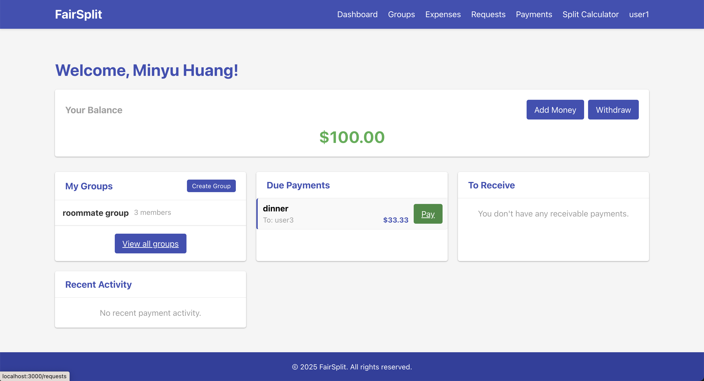
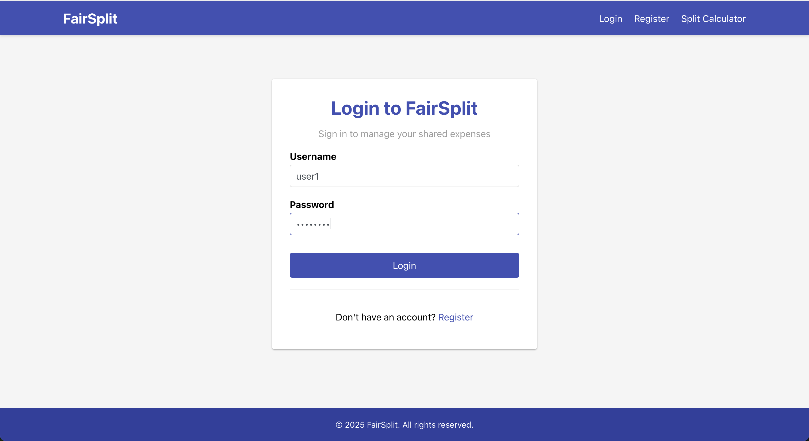
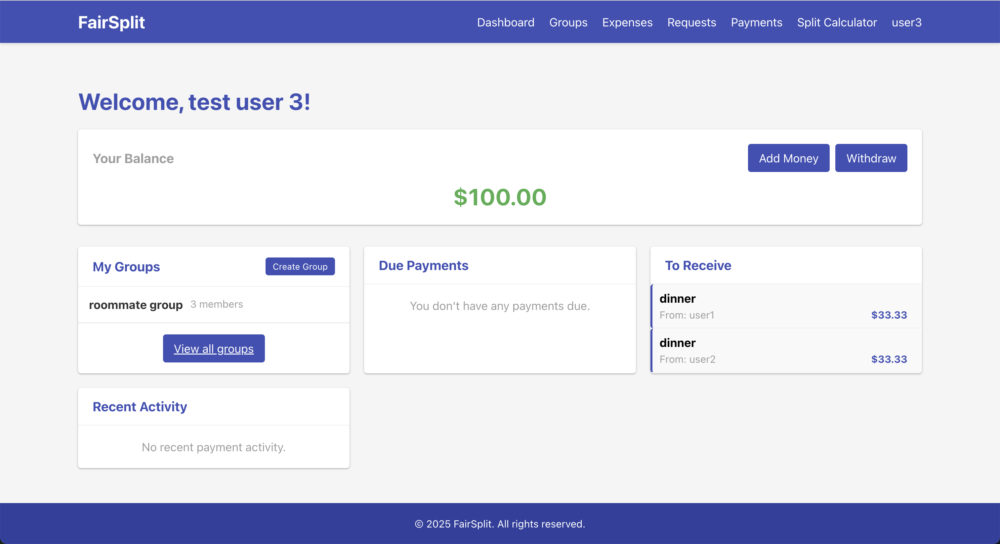
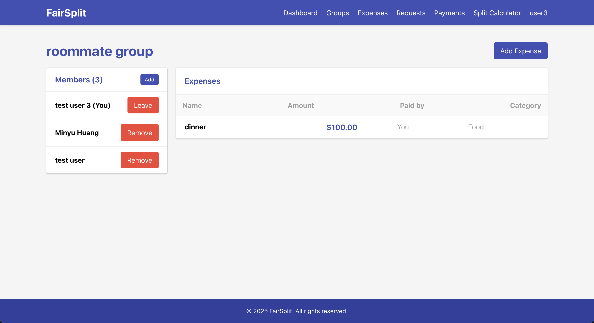
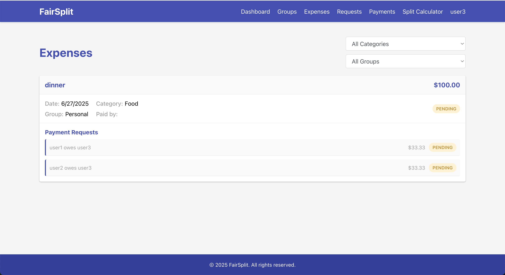
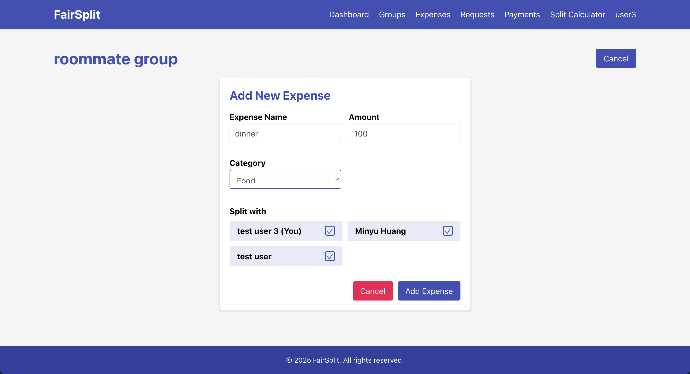
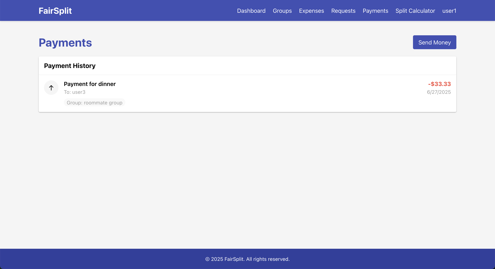
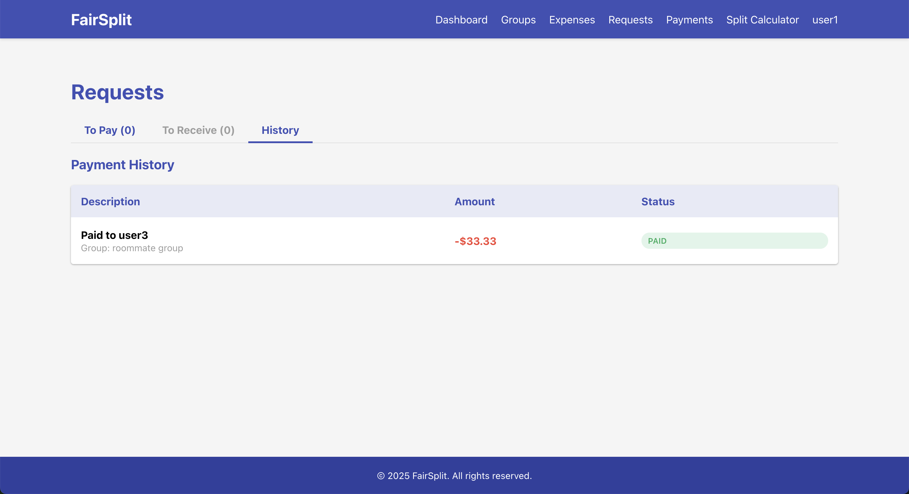

# Fairsplit

A comprehensive expense tracking and group payment splitting application that helps friends, roommates, and groups manage shared expenses efficiently.



## 🚀 Features

### Core Functionality
- **Group Expense Management**: Create groups and track shared expenses
- **Smart Expense Splitting**: Automatically split expenses among group members
- **Payment Tracking**: Monitor who paid what and who owes money
- **Request Management**: Send and manage payment requests
- **Real-time Balance Tracking**: Keep track of individual and group balances
- **Category-based Organization**: Categorize expenses (Food, Entertainment, Utilities, etc.)
- **User Authentication**: Secure login and registration system

### User Experience
- **Intuitive Dashboard**: Clean, modern interface for easy navigation
- **Responsive Design**: Works seamlessly on desktop and mobile devices
- **Real-time Updates**: Instant feedback on expense and payment changes
- **Filtering & Search**: Find specific expenses by category, group, or date range

## 🏗️ Architecture

Fairsplit is built with a modern, scalable architecture:

### Frontend
- **React 18** with functional components and hooks
- **React Router** for client-side routing
- **Axios** for API communication
- **CSS3** with custom styling for a modern UI

### Backend
- **Java 21** with Spring Boot 3.4.4
- **Spring Data JPA** for database operations
- **PostgreSQL** database
- **Lombok** for reducing boilerplate code
- **Maven** for dependency management

## 📱 Screenshots

### Login Interface


### Dashboard - Debtee View


### Dashboard - Debtor View


### Group Management


### Expense Overview


### Create New Expense


### Payment Management


### Request Management


## 🛠️ Installation & Setup

### Prerequisites
- Java 21+ (for Spring Boot backend)
- Node.js 18+ (for frontend)
- PostgreSQL database

### Frontend Setup

1. **Navigate to the frontend directory:**
   ```bash
   cd frontend
   ```

2. **Install dependencies:**
   ```bash
   npm install
   ```

3. **Start the development server:**
   ```bash
   npm start
   ```

The frontend will be available at `http://localhost:3000`

### Backend Setup

1. **Navigate to the Spring Boot backend directory:**
   ```bash
   cd Backend
   ```

2. **Configure database connection in `src/main/resources/application.properties`:**
   ```properties
   spring.datasource.url=jdbc:postgresql://localhost:5432/fairsplit
   spring.datasource.username=your_username
   spring.datasource.password=your_password
   ```

3. **Run the application:**
   ```bash
   ./mvnw spring-boot:run
   ```

## 📊 Database Schema

### Core Entities

#### Users
- User authentication and profile information
- Balance tracking for payments
- Group membership management

#### Groups
- Expense groups for organizing shared expenses
- Member management and permissions
- Group-specific settings

#### Expenses
- Expense details (name, amount, category)
- Payer and assigned users tracking
- Automatic request generation for debtors

#### Requests
- Payment requests between users
- Amount tracking and fulfillment status
- Linked to specific expenses

#### Payments
- Payment transactions between users
- Balance updates and history tracking
- Request fulfillment integration

## 🔌 API Endpoints

### Authentication
- `POST /api/auth/register` - User registration
- `POST /api/auth/login` - User login
- `POST /api/auth/logout` - User logout
- `GET /api/auth/session` - Get current session

### Users
- `GET /api/users` - Get all users
- `GET /api/users/:id` - Get user by ID
- `PUT /api/users/:id` - Update user
- `PUT /api/users/:id/balance` - Update user balance

### Groups
- `GET /api/groups` - Get all groups
- `POST /api/groups` - Create new group
- `GET /api/groups/:id` - Get group by ID
- `PUT /api/groups/:id` - Update group
- `DELETE /api/groups/:id` - Delete group

### Expenses
- `GET /api/expenses` - Get all expenses
- `POST /api/expenses` - Create new expense
- `GET /api/expenses/group/:groupId` - Get group expenses
- `PUT /api/expenses/:id` - Update expense
- `DELETE /api/expenses/:id` - Delete expense

### Requests
- `GET /api/requests` - Get all requests
- `POST /api/requests` - Create new request
- `PUT /api/requests/:id/accept` - Accept request
- `DELETE /api/requests/:id` - Delete request

### Payments
- `GET /api/payments` - Get all payments
- `POST /api/payments` - Create new payment
- `GET /api/payments/user/:userId` - Get user payments

## 🚀 Deployment

### Frontend Deployment
```bash
cd frontend
npm run build
# Deploy the build folder to your hosting service
```

### Backend Deployment
```bash
cd Backend
./mvnw clean package
java -jar target/Fairsplit-0.0.1-SNAPSHOT.jar
```

## 🤝 Contributing

1. Fork the repository
2. Create a feature branch (`git checkout -b feature/amazing-feature`)
3. Commit your changes (`git commit -m 'Add some amazing feature'`)
4. Push to the branch (`git push origin feature/amazing-feature`)
5. Open a Pull Request

## 📝 License

This project is licensed under the MIT License - see the [LICENSE](LICENSE) file for details.

## 🆘 Support

If you encounter any issues or have questions:

1. Check the existing issues in the repository
2. Create a new issue with detailed information about your problem
3. Include screenshots and error messages when possible

## 🔮 Future Enhancements

- **Mobile App**: Native iOS and Android applications
- **Real-time Notifications**: Push notifications for payment requests
- **Expense Analytics**: Charts and insights for spending patterns
- **Multi-currency Support**: International currency handling
- **Recurring Expenses**: Automated expense scheduling
- **Export Features**: PDF and CSV export for expense reports
- **Integration**: Connect with banking APIs for automatic expense import

---

**Fairsplit** - Making expense splitting fair and simple! 💰✨ 